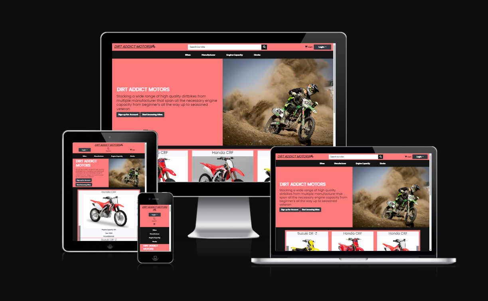
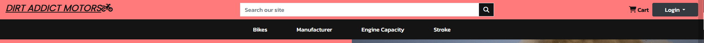
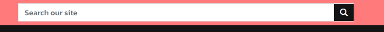
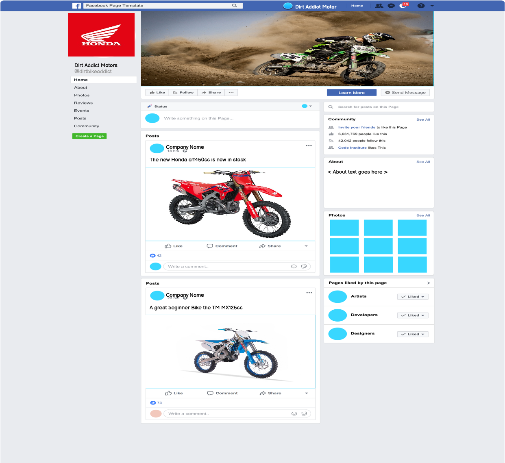
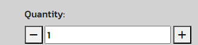
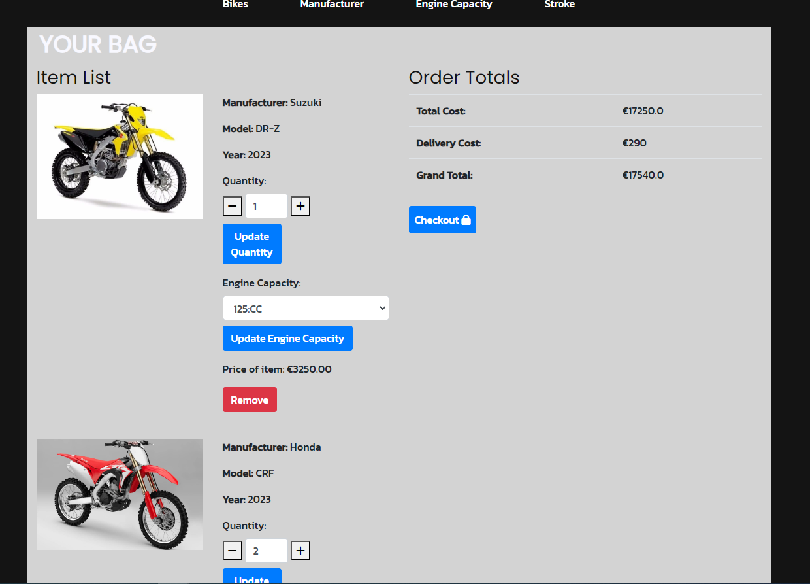
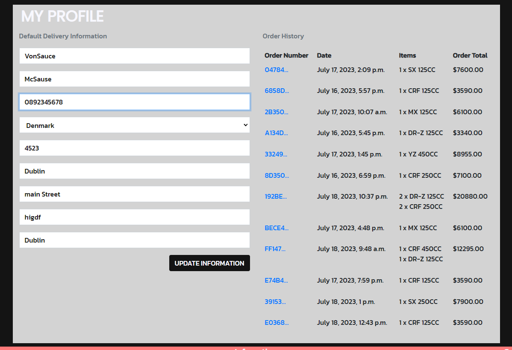
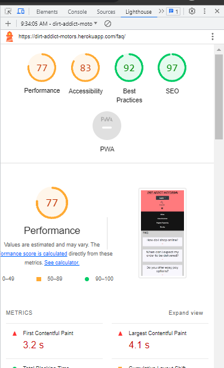

# Dirt Addict Motors



# Goal for this Project
My overall goal for the my project is to creata a website that will sell dirtbike. The user of the website will be able to purachase differernt dirtbikes from various manufacturer and their engine capacity. The User will be able to create a profile so they can make their purachase whicj will be mandartory. The user will be able to adjust the bike in the bag of the website to save time from removing items from the bag and looking for that engine capacity of the bike. The User will be able to save there inforamtion for future purachase so they can save time from filling out their inforamtion agian. The user will be able sign up for a newsltter to keep up to date with the website.

# UX
A user of Dirt Addict Motors can range from a begginner buying there first bike, a novice who may want to upgrade to a faster bike or a seasoned vertern who has much experience in what they are looking for
## User Stories

### Epic | Website Function
* As a SiteUser I can traverse the website so that I can move to other areas of the website easily
* As a SiteUser I can visit the socials of the website so that I can keep up to date with the website
* As a Site User I can sign up for a newsletter so that  I can stay up to date with website
* As a SiteUser I can view the delivery information for order so that I can know how much it will cost for deleivery
* As a SiteUser I can view the FAQS so that I can see the most relevant information

### Epic | Products
* As a SiteUser I can search for a specific bike so that I can quickly see if the bike is available that I am intresting.
* As a SiteUser I can be able to view a selection of bikes at instance so that I can see different types of bikes that are provided in the website
* As a SiteUser I can Sort information of the bikes so that bikes can be filtered by ascending and decending order for cost, year, and A-z
* As a SiteUser I can look at all the bikes that the site has so that I can see the arity of selection of bikes
* As a SiteUser I can View the individual bike object so that I can see me more detailed information on the bike
* As a Site Admin I can add more bikes to the website so that I can keep adding stock to the website
* As a Site Admin I can edit bikes on the website so that I can remove bikes that the store does not sell anymore
* As a SiteAdmin I can delete bikes from the website so that I can keep the website up to date with what is available in the store

### Epic | BAG
* As a SiteUser I can view my bag so that I can see my items in my bag
* As a SiteUser I can change the quantity of each item in the bag so that I don't have to go back to the individual product page to do it
* As a Site User I can change the engine capacity of the bike to another capacity so that I can quickly adjust the bag rather than removing the item to add another item one again
* As a SiteUser I can remove items from the bag so that I can adjust my bag to the purchase that I want to checkout with
### Epic | Checkout
* As a SiteUser I can view my order before checkout so that see I am happy with my purchase
* As a SiteUser I can give my delivery information so that my order can be delivered to the place I want it to
* As a site user I can **enter my payment details ** so that so that I can purchase my order
* As a SiteUser I can be redirected to the checkout success page so that know if my order was successful checkout
* As a SiteUser I can save my information on an order so that I can have default information instead of filling it out every time
### Epic | Profile
* As a SiteUser I can create an account for the site so that I can make purchases from the site
* As a SiteUser I can sign into my personal account so that ** I can view the detail of my account and make edits to the information
* As a SiteUser I can sign out of my account so that I am not logged in to my account anymore
* As a SiteUser I can I can have a profile page so that display my orders
* As a SiteUser I can save my information so that it can prerender their information when making an order

### Epic | Admin
* As a Admin I can view all the orders on the website so that update the status of the orders if they are complete

## User Requirements and Expectations

### Requirements

* Responsive Design for all screen sizes
* A structured layout to easily view the website 
* CRUD functionality for the products
* User registration
* Checkout Process
* Add to my bag fuction

### Expectations

* I expect to be able to sign in and sign out of my account.
* I expect to be able to add, edit and delete product as an admin.
* I expect to be able to add produsts to my bag.
* I expect to be able to checkout with my purachase.
* I expect to be able to view my orders.
* I expect to be able tro save my inforamtion to the site.

## Wireframes

I have used Balsamic to develop my wireframes for my website. I initially created the mobile version and then the wireframes and then scalled it up for both tablet and desktop. I only created layout's for page that would require alot of content and would change amongst the different screen sizes.

### [Mobile, Tablet and Desktop Wireframe](readmedoc/wireframe/dirtaddictmotor-wireframes.bmpr)


## Design Choices
### Fonts

The font I have chosen are both from [Google Fonts](https://fonts.google.com/)

The first font is [Kanit]((https://fonts.google.com/specimen/Kanit?query=kanit)) which will be the main font that will be seen throughout the website. It will be implemented on all font contnet. Reason from for picking this font is that it is clearly distinguishable from the header font that is very plain and simple as appose to Sono being a very striking font.

The second font is [Poppins]((https://fonts.google.com/specimen/Poppins?query=poppins)) which will be used on all header on the website. Reason for picking the font is mainly due to it plain and simplicity outlook when shown.

### Colours

For choosing my Colors for the website I used [ColorHexa](https://www.colorhexa.com/) and used to [Muzli Colors](https://colors.muz.li/) to create a pallet of the colors.

The colors I choose

.svg "Color Pallet" )
Disregard the last color

| Hex Value | Root variable name | Text | Button | Background | Opposite Colour
| -- | -- | -- | -- | -- | --
| #FF7A7A | red |  |    | x | black,
| #f8f8ff | white | x | x| | black,
| #d3d3d3 | grey |  |  |   x | black ,
| #141414 | black | x | x |  x | grey, white, red,

All of the desired colour combinations have passed the [WebAIM Contrast Checker](https://webaim.org/resources/contrastchecker/ "WebAIM") and the results can be seen below.

| Colour 1 | Colour 2 | Results
| -- | -- | --
| red | black | [result](readmedoc/colors/red-black-test.png)
| red | white | [result](readmedoc/colors/red-black-test.png)
| white | black | [result](readmedoc/colors/white-black-test.png)
| grey | black | [result](readmedoc/colors/black-grey-test.png)

### Images

I have included some images that will render from local files.

* The image on the index page


* the image that will display when the bike has no image


* the image for the honda Manufacturer bikes


* the image for the honda Yamaha bikes


* the image for the honda KTM bikes


* the image for the honda Suzuki bikes


* the fav icon


## Structure

### Modal Diagram

Diagram of all the model of the site


### Models Info

UserProfile Model

| Name | Key | Type | Other Details
| -- | -- | -- | --
| user | | OneToOneField(User, on_delete=models.CASCADE)
|default_phone_number | | CharField(max_length=20, null=True, blank=True)
| default_street_address1 | | CharField(max_length=80, null=True, blank=True)
| default_street_address2 | | CharField(max_length=80, null=True, blank=True)
| default_town_or_city | | CharField(max_length=40, null=True, blank=True)
| default_county | | CharField(max_length=80, null=True, blank=True)
| default_postcode | | CharField(max_length=20, null=True, blank=True)
| default_country | | CountryField(blank_label='Country', null=True, blank=True)

Subscriber Model 

| Name | Key | Type | Other Details
| -- | -- | -- | --
| email | | EmailField(unique=True)
| subscribed_at | | DateTimeField(auto_now_add=True)

Bikes Model

| Name | Key | Type | Other Details
| -- | -- | -- | --
| manufacturer | | models.CharField(max_length=100)
| model | | models.CharField(max_length=100)
| year | | models.IntegerField(validators=[MinValueValidator(1950),MaxValueValidator(2100)], default=2024),
| stroke | | models.IntegerField(choices=STROKE_CHOICES)  STROKE_CHOICES = ((2, '2-stroke'),(4, '4-stroke'),)
| engine_capacity | | models.DecimalField(max_digits=5, decimal_places=2)
| speed | | models.IntegerField()
| weight | | models.DecimalField(max_digits=8, decimal_places=2, default=90)
| seat_height | | models.DecimalField(max_digits=8, decimal_places=2, default=90)
| price | | models.DecimalField(max_digits=8, decimal_places=2)
| starter | | models.CharField(max_length=50, default="Kick")
| description | | models.TextField()
| sku | | models.CharField(max_length=254, null=True, blank=True)
| image | | CloudinaryField(null=True, blank=True)
| created_at | | models.DateTimeField(auto_now_add=True)
| modified_at | | models.DateTimeField(auto_now=True)

Order Model 
| Name | Key | Type | Other Details
| -- | -- | -- | --
| user_profile | ForeignKey | (UserProfile, on_delete=models.SET_NULLnull=True, blank=True related_name='orders')
| order_number | | models.CharField(max_length=32, null=False, editable=False)
| full_name | | models.CharField(max_length=50, null=False, blank=False)
| email | | models.EmailField(max_length=254, null=False, blank=False)
| phone_number | | models.CharField(max_length=20, null=False, blank=False)
| street_address1 | | models.CharField(max_length=80, null=False, blank=False)
| street_address2 | | models.CharField(max_length=80, null=True, blank=True)
| postcode | | models.CharField(max_length=40, null=True, blank=True)
| town_or_city| | models.CharField(max_length=40, null=False, blank=False)
| county | | models.CharField(max_length=80, null=False, blank=False)
| country | | CountryField(blank_label="Country *", null=False, blank=False)
| date | | models.DateTimeField(auto_now_add=True)
| payment_status | | models.CharField(max_length=50, choices=(('PENDING', 'Pending'),('PAID', 'Paid'),('CANCELLED''Cancelled')))
| delivery_cost | | models.DecimalField(max_digits=10, decimal_places=2,null=False, default=0)
| order_total | | models.DecimalField(max_digits=10, decimal_places=2,null=False, default=0)
| grand_total | | models.DecimalField(max_digits=10, decimal_places=2,null=False, default=0)
| original_bag | | models.TextField(null=False, blank=False, default="")
| stripe_pid | | models.CharField(max_length=254, null=False,blank=False, default="")

Order Item
| Name | Key | Type | Other Details
| -- | -- | -- | --
| order | ForeignKey |(Order, on_delete=models.CASCADE,related_name='order_items')
| bike | ForeignKey | (Bikes, on_delete=models.CASCADE)
| quantity | | models.PositiveIntegerField()
| price | | models.DecimalField(max_digits=10, decimal_places=2)


## App Flow

### User


### Admin


# Features

## Existing Features

- **Landing Page**
- This is the landing page that a user will arive on when they first vist the website, the user will see a brief message stating what the website is. There will be two button one button will bring the user to the product page so they can start looking at the bikes in the store and the other button based on if the user is signed or not will see a button that says Sign up for Account if they are not signed up or if they are signed in they will be able to go to their profile for the site


- View if the user is signed in


- Present on all page are the navbars and the footer

Desktop Navbar



Mobile Navbar


Signin/logout menu


- This menu is for the user so sign in and out of the user's account, it will also have a link to the user's profile.

The logo for the site which will redirect the User back to the home page when clicked


- The search bar can be used by the useer to search for query that are associated with the bikes of the store




- A result for kick that will show all the bikes that have a kick starter


- A result for kawaski that show no result found as there are no kawasaki currently in the store

On mobile screen the search bar must be turned on by clicking the search icon

Search bar closed


Search bar Open


- The category navigation will also operated on different screen sizes

On Desktop it will work like a dropdown menu


On mobile it will work as an accordion menu


- For both screen size if one menu is open the other one will close.

- Below the the image and the message is the slide show that will display three different bikes on three slides the user can navigate the slideshow with the button or they can wait 6 seconds for the next slide. The user can also click the image of the bike that will bring them to the product detail page of that bike for more inforamtion.


- Below the slideshow are the manufacturer logo that are most populer in terms of popularity. Clicking one of the logo will bring the user to the product page displaying all the bikes of that maufacturer


- Display at the bottom of the page will always show the footer


- Area of not on the footer are the link to the Inforamtion pages and if the user is the admin they will be able to access the Admin order page


- Another Area of note are the social medie of the website, clicking the link will open the link in another page


Example of the Facebook Business page of the Website



- **FAQ**
- The faq page will give user a view of all the most relevent questions that they would nee to now about the website


- the user can click the question to view the answer of the question, clicking on another question will close the question and open the new question


- **Delivery**
- The delivery inforamtion page will display the necessity about how the delivery cost is calculated


- **Newsletter**
- The newsletter page will allow the user to sign of for the sites newsletter


- When the email is entered and submitted it will send the user an email of confiramtion


- **Product Page**
- The product page will display all the bikes of that are avaible on the website. The user can click on the image or the title of the bike and it will bring the user to the product detail page of that bike. The user can also click the add to cart button that will add the bike to the bag with a quanity of 1.


- View after a bike is added to the bag after clicking the add to cart button, it will show the bike in the message container and the cart icon in the nav will update by 1.


- The user can also select different sort to order by certain option if they want to see newer bikes, older bikes, highest price or lowest pirce


- The user can also click on any of the category link to display the filter that is assigend to the link, ie engine capacity, stroke and manufacturer

- Examples of filter

- Engine Capacity filter


- Stroke Filter


- Manufacturer Filter


- **Product Detail**
- The product detail page will give the user more inforamtion on the bike.


- The user can adjust the quanity of the bike if they want more than the default value of 1 and then click the add to cart button to add that quanity of bike to the bag

- Quanity buttona


- Button that will add the bike to the bag


- If the user is an admin they will be able to click the edit button and the delete button.


- When the edit buttons is clicked it will bring the user to the edit-bike page that will diaply the inforamtion in a form that the admin can change any inforamtion on the bike.


- When the delete button is cliked it will prompt the confiramtion box for a decision if they want to delete the bike from the store, if yes is clicked the bike will be delete and if no is clicked the prompt will disappear with the bike remain.


- **Bag**
- The bag page will hold bikes that the user has interest in purchasing. The bag will hold each item tat has been added to the bag that will show the manufacturer, model, year, engine capacity, quanitity, price of the bike, the total price of that bike if there is more than one quanity in the bike. The bag will also show the total cost of the bag with the deleivery cost added to the grand total.



- If the bag has no items in the bag it will display the view below


- The user will also have the chance to adjust the items in the bag. Adjustment that the user can do are change the quanity in te bag that is very similar to the quanity counter in the product deatil page with the exception of the user having to press the update quanity counter. The user can also change the engine capacity of the bike if that model has mutiple engine capacity values. This also needs to be update by a button that is labled update engine capacity. Through different scenario the adjustment of the engien capacity can modify the bag in many ways. If two bikes are in the bag that are the same model but different engine capcity, if one of the bike is updated to the other bikes engine capacity instead of having instance of the bike in the bag. The updated bike will be removed and the quanity of the other bike will be add to of the delted bike. This works the same with adding bikes to the bag through the products page or the product detail page, this is to stop having repeat object in the bag. If the user set the quanity to zero it will remove the bike form the bag.


- Button that handles the adjusment of the engine capcity


- Button that handles the adjusment of quantity

- Each adjustment of the item will update the grand total of the bag.


- When the user is happy with their bag they can click the checkout button to procces the order


- **Checkout**
- When the user checks his bag out, they will be brought to the checkout page. On this page the user will have to fill out his inforamtion so the the order can be processes. Inforamtion required will be in three areas of personal detail, delivery details and payment details. Once the inforamtion is inputted the user can check their order out. If inforamtion is not valid the error will be display on either the field that is in question or if it is a payment error it will be display above the card input. If the checkout is succesful the loading overlay will show then the user will be redirect to the checkout succes page. On deafult the inforamtion in the personal detail and the delivery detail will be saved to the user profiles for future orders.

- The view of the page


- The checkout form will all the required areas


- The order summary of the items that will be in the order


- The order summary of the the grand total


- The save-info check for if the user would like there inforamtion saved


- The complete order button that will submit the order with a button that will also let the user adjust their bag


- **Checkout Success**
- When the user has successful checked out they will be redirected to the checkout success page that will inform the user that their order has been proccesed. They will be informed that an email has been sent to there emial that was submitted in the checkout form and it will show all the relevent inforamtion of the order.


- Confiramtion Email when the checkout is successful


- **Profile**
- The user can access his profile from the navbar. In the profile page the user can look at their order history ,which detail by the order number, date of order, the items of the order and the order total. The user can click the order number to view the checkout success page for more inforamtion. The user can also update the default inforamtion that was saved when the user made their order.

- View of the profile Page



- All of the orders of the user


- The update default information form


- **Admin-order**
- The admin order page is for the admin of the site to track order of the website so they can adjust the status of the order. It also has a add-bike button that will allow the user to add bikes to the store.


- The admin can adjust the status of an order by changing the order status in the option box, the option that it can be applied are paid, pending and cancelled. When the order is first received it will be marked as past If anything was to change for that order the admin can change the satus od the order.


- The user can also add bikes to the store by clicking the add bike button, once the bike is clicked the user will be redirect to the add-bike form where they can add theinforamtion needed for a bike and the submit the bike


## Features to be Implemented

As it is a store that sells dirtbike there certain area that could be expaned upon that would include

- A section that sell dirtbike apparel ie helmuts, boots, gloves, pants
- A section that will sell part of the bikes in the store
- A booking service for users to get maintenance on the bikes
- A slideshow for the product detail that will show more images for the bike
- Add more content to the admin order page like inventory tracking
- Add a 24/4 customer support area
- Add a blog area to build a commuinity around the website that could set up meet ups at a dirt track


# Tools and Technologies used

- [HTML](https://en.wikipedia.org/wiki/HTML) used for the main site content.
- [CSS](https://en.wikipedia.org/wiki/CSS) used for the main site design and layout.
- [CSS :root variables](https://www.w3schools.com/css/css3_variables.asp) used for reusable styles throughout the site.
- [Bootstrap](https://getbootstrap.com) used as the front-end CSS framework for modern responsiveness and pre-built components.
- [jQuery](https://jquery.com/) used for the hamburger menu and the dropdown menu.
- [JavaScript](https://www.javascript.com) used for user interaction on the site for automatically closing Django Messages and to handle the notification dropdown and notification delete functions.
- [Python](https://www.python.org) used as the back-end programming language.
- [Git](https://git-scm.com) used for version control.
- [GitHub](https://github.com) used for secure online code storage.
- [Gitpod](https://gitpod.io) used as a cloud-based IDE for development.
- [Django](https://www.djangoproject.com) used as the Python framework for the site.
- [PostgreSQL](https://www.postgresql.org) used as the relational database management.
- [Stripe](https://www.stripe.com) used for processing tranaction.
- [ElephantSQL](https://www.elephantsql.com) used as the Postgres database.
- [Heroku](https://www.heroku.com) used for hosting the deployed back-end site.
- [Cloudinary](https://cloudinary.com) used for online static file storage.
- [WebAIM Contrast Checker](https://webaim.org/resources/contrastchecker/) used to check contrast between colours on the site
- [Balsamiq](https://balsamiq.com/wireframes) used to design my site wireframes.
- [XConvert](https://www.xconvert.com/compress-webp) used to compress images
- [Color-Hex](https://www.color-hex.com/) used to pick colors
- [Color Hunt](https://colorhunt.co/) used to create a color pallet
- [Kapwing](https://www.kapwing.com/tools/add-text/image) used to edit images.

# Testing

## Code Validation

### HTML

I have used the [HTML W3C Validator](https://validator.w3.org) to validate all of my HTML files.

As my project uses Jinja syntax, such as ``, ``, and `{{ variable|filter }}`
it will not validate properly if I copy and paste into the HTML validator straight from my source files.

In order to properly validate my HTML pages with Jinja syntax for authenticated pages, I followed these steps:

- Navigate to the deployed pages which require authentication
- Right-click anywhere on the page, and select **View Page Source**.
- This will display the entire "compiled" code, without any Jinja syntax.
- Copy everything, and use the [validate by input](https://validator.w3.org/#validate_by_input) method.
- Repeat this process for every page that requires a user to be logged-in/authenticated.

| Page | Screenshot | Notes |
| --- | --- | --- |
| Home |  | Pass: No Errors
| FAQ |  | Pass: No Errors
| Delivery Info |  | Pass: No Errors
|  Newsletter |  | Pass: No Errors
| Admin-order-history |  | Pass: No Errors
| Product |  | Pass: No Errors
| Product Detail |  | Pass: No Errors
| Add Bike |  | Pass: No Errors
| Edit Bike |  | Pass: No Errors
| Profile |  | Pass: No Errors
| Checkout |  | Pass: No Errors
| Checkout Success |  | Pass: No Errors
| Home |  | Pass: No Errors


### CSS

I have used the recommended [CSS Jigsaw Validator](https://jigsaw.w3.org/css-validator) to validate my CSS file.

| File | Screenshot | Notes |
| --- | --- | --- |
|base.css |  | Pass: No errors
|product.css |  | Pass: No errors
|checkout.css |  | Pass: No errors
|profile.css |  | Pass: No errors

### Javascript

I have used the recommended [JShint Validator](https://jshint.com) to validate all of my JS files.

| File | Screenshot | Notes |
| --- | --- | --- |
| main.js |  | Pass: No Errors
| add-edit script.js |  | Pass: No Errors
| faq-script.js |  | Pass: No Errors
| index-script.js |  | Pass: No Majors Errors
| product-detail-script.js |  | Pass: No Errors
| profile-script.js |  | Pass: No Errors
| stripe-elements.js |  | Pass: No Errors

### Python

I have used the recommended [CI Python Linter](https://pep8ci.herokuapp.com) to validate all of my Python files.

| File | Screenshot | Notes |
| --- | --- | --- | --- |
| settings.py |  | Pass: No Errors
| urls.py (home) |   | Pass: No Errors
| urls.py (bag) |   | Pass: No Errors
| urls.py (checkout) |   | Pass: No Errors
| urls.py (products) |  | Pass: No Errors
| urls.py (profiles) |   | Pass: No Errors
| views.py (profiles) |   | Pass: No Errors
| views.py (home) |   | Pass: No Errors
| views.py (bag) |   | Pass: No Errors
| views.py (checkout) |   | Pass: No Errors
| views.py (products) |   | Pass: No Errors
| models.py (products) |   | Pass: No Errors
| models.py (checkout) |   | Pass: No Errors
| models.py (home) |  | Pass: No Errors
| models.py (profiles) |   | Pass: No Errors
| forms.py (profiles) |   | Pass: No Errors
| forms.py (checkout) |   | Pass: No Errors
| forms.py (home) |   | Pass: No Errors
| forms.py (product) |   | Pass: No Errors
| contexts.py (product) |   | Pass: No Errors
| context.py (bag) |  | Pass: No Errors
| webhook~_handler.py (checkout) |  | Pass: No Errors
| webhooks.py (checkout) |  | Pass: No Errors


## Lighthouse Audit

I've tested my deployed project using the Lighthouse Audit tool to check for any major issues.

| Page | Size | Screenshot | Notes |
| --- | --- | --- | --- |
| Home | Desktop |  | Some major warnings |
| Home | Mobile |  | Some major warnings |
| Addbike | Desktop |  | no major warnings |
| Addbike | Mobile |  | no major warnings |
| Adminorder | Desktop |  | no major warnings |
| Adminorder | Mobile |  | no major warnings |
| Bag | Desktop |  | no major warnings |
| Bag | Mobile |  | no major warnings |
| Checkout | Desktop |  | no major warnings |
| Checkout | Mobile |  | no major warnings |
| Checkout Success | Desktop | | no major warnings |
| Checkout Success | Mobile |  | no major warnings |
| Delivery Info | Desktop |  | no major warnings |
| Delivery Info | Mobile | | no major warnings |
| Edit Bike | Desktop |  | no major warnings |
| Edit Bike | Mobile |  | no major warnings |
| FAQ | Desktop |  | no major warnings |
| FAQ | Mobile |  | no major warnings |
| Newsletter | Desktop |  | no major warnings |
| Newsletter | Mobile |  | no major warnings |
| Product | Desktop |  | no major warnings |
| Product | Mobile |  | no major warnings |
| Product Detail | Desktop |  | no major warnings |
| Product Deatil | Mobile |  | no major warnings |
| Profiles | Desktop |  | no major warnings |
| Profiles | Mobile |  | no major warnings |


## Defensive Programming

Defensive programming was manually tested with the below user acceptance testing:

| Page | User Action | Expected Result | Pass/Fail | Comments |
| --- | --- | --- | --- | --- |
| **Home Page** | | | | |
|| | Click on Logo in the navbar | Redirects to Home page | Pass | |
|| | Click cart Icon in navbar | Redirects to Bag page | Pass | |
|| | Click on Login button when not signed in | Dropdown menu show | Pass |
|| | Click on My account button when signed in | Dropdown menu show | Pass |
|| | Enter Query in to the search bar and click search button | Redirect to product page with search filter showning or message for no search found | Pass |
|| | Click Bikes, Manufacturer, stroke and engine capacity name in the categorey | Dropdown menus show for that category | Pass | 
|| | Click By Price link in the bikes category dropdown | Redirects to the products page, shows bikes order by Highest price, sort by is Price(high to Low) | Pass
|| | Click By Year link in the bikes category dropdown | Redirects to the products page, show the bikes order by most recent year, sort is Year(high to low) | Pass
|| | Click By All bikes link in the bikes category dropdown | Redirects to the products page, shows all bikes in the website, bike order A-z by manufacturer and sort | Pass  
|| | Click on a Manufacturer link in the Manufacturer dropdown | Redirects to the product page, show all the bikes of that manufacturer, ordered by engine capacity | Pass
|| | Click on a Engine Capacity link in the engine capacity dropdown | Redirects to the product page, show all the bikes of that enginecapcity, ordered by A-z manufacturer | Pass
|| | Click on a Stroke link in the stroke dropdown | Redirects to the product page, show all the bikes of that stroke, ordered by engine capacity | Pass
|| | Click on My profile link in the dropdown menu when logged in | Redirects to the user profile page | Pass 
|| | Click on logout button in the dropdown menu when logged in | Redirects to the logout page  | Pass 
|| | Click on My account link in homepage | Redirects to the user profile page | Pass
|| | Click on Start browsing bikes link in homepage | Redirects to the products page, shows all bikes in the website, bike order A-z by manufacturer and sort | Pass
|| | Click on login link in the dropdown menu when not logged in | Redirects to the the sign in page | Pass
|| | Click on register link in the dropdown menu when not logged in | Redirects to the the sign up page | Pass
|| | Click on the bike slide in the carousel | Redirects to the product detail page of that bike | Pass
|| | Click the next button on the carousel | Show the next three bikes in the carousel | Pass
|| | Click the next button on the carousel on the last slide | button is disabled | Pass
|| | Click the previous button when on the first slide | Button is disabled | Pass
|| | Click the previous button when not on the first slide | goes back a slide | Pass
|| | Click on a manufacture logo | Redirects to the product page, show all the bikes of that manufacturer, ordered by engine capacity | Pass
|| | Click on the FAQ in the footer | redirects to the faq page | Pass
|| | Click on the Newsletter in the footer | redirects to the newsletter page | Pass
|| | Click on the Delivery Info in the footer | redirects to the Delivery Info page | Pass
|| | Click on the Admin Orders when signed in as admin in the footer | redirects to the Admin order page | Pass
|| | Click the Search icon on the mobile view of the website| Will show the search bar | Pass
|| | Click the category name on the mobile view | Will open the menu in a  accoriden style | Pass
|| | Click another category name when another is open | the open when will close and the close one will open | P ass
| **Product Page** | | | | |
|| | Click the Bike images of a product | Redirects to the product detail of that bike | Pass
|| | Click the Bike Title of a product | Redirects to the product detail of that bike | Pass
|| | Click the Add to cart button of a product | Adds the bike to the bag, cart icon update by 1 | Pass
|| | Change sort filter to Manufacturer A-Z | Sorts bikes by Manufacturer A-Z | Pass
|| | Change sort filter to Manufacturer Z-A | Sorts bikes by Manufacturer Z-A | Pass
|| | Change sort filter to Price High-Low | Sorts bikes by Price High-Low | Pass
|| | Change sort filter to Price Low-High | Sorts bikes by Price Low-High  | Pass
|| | Change sort filter to Year High-Low | Sorts bikes by Year High-Low | Pass
|| | Change sort filter to Year Low-High | Sorts bikes by Year Low-High | Pass
|| | Change sort filter to Default | Sorts bikes by Manufacturer A-Z | Pass
|| | Click on the next button when showing | goes to next page of bikes | Pass
|| | Click on the previous button when showing | goes to previous page of bikes | Pass
| **Product Detail Page** | | | | |
|| | Click on the add to Cart | Adds the bike to the bag, cart Icon updatas to value of quanity | Pass
|| | Click on the add to Cart with adjusted quanity | Adds to the bag with that quanity, cart icon updates to the value of the adjust quanity | Pass
|| | Click the + sign on the quanity | Add one to the quanity counter | Pass
|| | Click the - sign on the quanity | Decrease one to the quanity counter | Pass
|| | Click the edit bike button as the admin | the admin will be brought to the Edit bike Page | Pass
|| | Click the delete bike button as the admin | the delete confiramtion will be shown | Pass
|| | Click yes on the delete confiramtion bike | the bike will be deleted and the admin will be brough to the products page | Pass
|| | Click no on the delete confiramtion bike | the delete confiramtion will be removed | Pass
| **Bag Page** | | | | |
|| | Click the + sign on the quanity | Add one to the quanity counter | Pass
|| | Click the - sign on the quanity | Decrease one to the quanity counter | Pass
|| | Click the update quanity button when quanity has been changed | Quanity will change to that value | Pass
|| | Click the update quanity button when the value has not changed | Message show informing the no change has been made | Pass
|| | Click the update quanity button when the value is 0 | Bike will be removed from the bag | Pass
|| | Click the update engine capacity when the value has changed | Engine capacity will change to that value | Pass
|| | Click the update engine capacity when the value has not changed | Message show informing the no change has been made | Pass
|| | Click the update engine capacity when the value is changed to a value that already exist in the bag that has the same model | Bike will be removed from bag and the quanity will be added to the other bag | Pass
|| | Change the quanity of a bike then update the bike to another engine capacity that is already in the bag with the same model| Bike will be removed from bag and the quanity will be added to the other bag | Pass
|| | Add a bike to the bag when it already is in the bag | Adds to the bikes quantity | Pass
|| | Click the remove button on a bike in the bag | Will remove the bike from the Bag | Pass
|| | Click the checkout button in the bag | Will bring the user to the checkout page | Pass
|| | Click the checkout button in the bag when not signed in | The user is brought back to the sign in page | Pass
| **Checkout page** | | | | 
|| | When invalid data is place in the Personal Detail form and the user trys to checkout| An error message will be shown on the field in question | Pass
|| | When invalid data is place in the Delivery Detail form and the user trys to checkout| An error message will be shown on the field in question | Pass
|| | When invalid data is place in the Payment form | An error message will be shown above the input the form | Pass
|| | When the User has there inforamtion saved from a previous purachase | Inforamtion will be prerendered | Pass
|| | When the user has inputted correct data in both the payment and delivery inforamtion | The checkout will be proccessed and will be redirect to the checkout success page | Pass
|| | when the user click the adjust bag link | the user should be redirect to the bag | Pass
| **Profiles** | | | | 
|| | Click on a order number of a order | Brings the user to the checkout succes page of that order | Pass
|| | Change data in the Default Delivery Information and click the update inofrmaiton | The inforamtion will be updated | Pass
|| | click the update inforamtion button when no info has changed | message is display saying no update has occured | Pass
|| | Click the bike to store button as admin | Brings the admin to the Add bike page | Pass
| **Admin Orders** | | | | 
|| | Click on a order number of a order | Brings the user to the checkout succes page of that order | Pass
|| | Changes the order status of an order and click the update button | order status changes to the value that was subbmited | Pass
| **Newsletter** | | | | 
|| | click on the sign up button on the newsletter page | user will be redirect to the home page and a messages saying the sign up was successful | Pass
| **FAQ** | | | | |
|| | When the user clicks the question in the container | the answer will open accordin style | Pass
|| | When the user click the quation of a container when another container is opened | THE container will close and the new container will open with the answer | Pass

## User Story Testing

The following are user stories I've implemented with screenshots to prove

| User Story | Screenshot |
| --- | --- |
| As a SiteUser I can traverse the website so that I can move to other areas of the website easily | 
| As a SiteUser I can visit the socials of the website so that I can keep up to date with the website | 
| As a SiteUser I can view the delivery information for order so that I can know how much it will cost for deleivery | 
| As a SiteUser I can view the FAQS so that I can see the most relevant information | 
| As a SiteUser I can search for a specific bike so that I can quickly see if the bike is available that I am intresting. | 
| As a SiteUser I can be able to view a selection of bikes at instance so that I can see different types of bikes that are provided in the website | 
| As a SiteUser I can Sort information of the bikes so that bikes can be filtered by ascending and decending order for cost, year, and A-z | 
| As a SiteUser I can look at all the bikes that the site has so that I can see the arity of selection of bikes | 
| As a SiteUser I can View the individual bike object so that I can see me more detailed information on the bike | 
| As a Site Admin I can add more bikes to the website so that I can keep adding stock to the website | 
| As a Site Admin I can edit bikes on the website so that I can remove bikes that the store does not sell anymore | 
| As a SiteAdmin I can delete bikes from the website so that I can keep the website up to date with what is available in the store | 
| As a SiteUser I can view my bag so that I can see my items in my bag | 
| As a SiteUser I can change the quantity of each item in the bag so that I don't have to go back to the individual product page to do it | 
| As a Site User I can change the engine capacity of the bike to another capacity so that I can quickly adjust the bag rather than removing the item to add another item one again | 
| As a SiteUser I can remove items from the bag so that I can adjust my bag to the purchase that I want to checkout with | 
| As a SiteUser I can view my order before checkout so that see I am happy with my purchase | 
| As a SiteUser I can give my delivery information so that my order can be delivered to the place I want it to | 
| As a site user I can enter my payment details so that so that I can purchase my order 
| As a SiteUser I can be redirected to the checkout success page so that know if my order was successful checkout | 
| As a SiteUser I can save my information on an order so that I can have default information instead of filling it out every time | 
| As a SiteUser I can sign into my personal account so that I can view the detail of my account and make edits to the information | 
| As a SiteUser I can sign out of my account so that I am not logged in to my account anymore | 
| As a SiteUser I can I can have a profile page so that display my orders | 
| As a Admin I can view all the orders on the website so that update the status of the orders if they are complete | 


## Bugs

| Bug | Status |
| --- | --- |
| Bike not adding to quanity, if bike was updated #26 | Closed
| Price not updating when for quanity #11 | Closed
| Engine Capacity updating in bag when it is not the same of the other model #10 | Closed
| No search query message showing on any access to the product.html #9 | Closed
| Allauth html not extending from it's Base.html #8 | Closed
| Engine capacity and stroke dropdown menu's showing repeat values. #7 | Closed
| Engine Capacity change on Bag view #6 | Closed

# Deployment

The live deployed application can be found deployed on [Heroku](https://dirt-addict-motors.herokuapp.com/)

## ElephantSQL Database

This project uses [ElephantSQL](https://www.elephantsql.com) for the PostgreSQL Database.

To obtain your own Postgres Database, sign-up with your GitHub account, then follow these steps:
- Click **Create New Instance** to start a new database.
- Provide a name for the database
- Select the **Tiny Turtle (Free)** plan.
- You can leave the **Tags** blank.
- Select the **Region** and **Data Center** closest to you.
- Once created, click on the new database name, where you can view the database URL and Password.

## Cloudinary API

This project uses the [Cloudinary API](https://cloudinary.com) to store media assets online.

To obtain your own Cloudinary API key, create an account and log in.
- For *Primary interest*, you can choose *Programmable Media for image and video API*.
- Optional: *edit your assigned cloud name to something more memorable*.
- On your Cloudinary Dashboard, you can copy your **API Environment Variable**.
- Be sure to remove the `CLOUDINARY_URL=` as part of the API **value**; this is the **key**.

## Stripe

This project use [Stripe](https://www.stripe.com/) to handle the tranction of the payment

- To obtain Stipes API keys, create an account and log in.
- On the Stripe home page click the Publishable key, this will copy the key to the clipbored
- Add the public key to heroku
- On the Stripe home page click reveal Secret key
- Click the the key to copy
- Add the Secret Key to heroke
- Click the developer link in the home page
- Click the webhooks link underneath the developer header
- Click Add endpoint
- Add the endpoint URL to the input
- Click the select event button 
- Click select all events button
- Click the Add event button
- Click the the webhook that was created
- Click the Reveal on the Signing Secret Label
- Copy the key
- Add the WH key to the Heroku

## Heroku Deployment

This project uses [Heroku](https://www.heroku.com), a platform as a service that enables developers to build, run, and operate applications entirely in the cloud.

Deployment steps are as follows, after account setup:

- Select **New** in the top-right corner of your Heroku Dashboard, and select **Create new app** from the dropdown menu.
- Your app name must be unique, and then choose a region closest to you (EU or USA), and finally, select **Create App**.
- From the new app **Settings**, click **Reveal Config Vars**, and set your environment variables.

| Key | Value |
| --- | --- |
| `CLOUDINARY_URL` | insert your own Cloudinary API key here |
| `DATABASE_URL` | insert your own ElephantSQL database URL here |
| `DISABLE_COLLECTSTATIC` | 1 (*this is temporary, and can be removed for the final deployment*) |
| `SECRET_KEY` | this can be any random secret key |
| `PORT` | 8000 |

Heroku needs two additional files in order to deploy properly.
- requirements.txt
- Procfile

Add these variables to settings.py
STRIPE_PUBLIC_KEY = os.getenv('STRIPE_PUBLIC_KEY', '')
STRIPE_SECRET_KEY = os.getenv('STRIPE_SECRET_KEY', '')
STRIPE_WH_SECRET = os.getenv('STRIPE_WH_SECRET', '')

You can install this project's **requirements** (where applicable) using:
- `pip3 install -r requirements.txt`

If you have your own packages that have been installed, then the requirements file needs updated using:
- `pip3 freeze --local > requirements.txt`

The **Procfile** can be created with the following command:
- `echo web: gunicorn app_name.wsgi > Procfile`
- *replace **app_name** with the name of your primary Django app name; the folder where settings.py is located*

For Heroku deployment, follow these steps to connect your own GitHub repository to the newly created app:

Either:
- Select **Automatic Deployment** from the Heroku app.

Or:
- In the Terminal/CLI, connect to Heroku using this command: `heroku login -i`
- Set the remote for Heroku: `heroku git:remote -a app_name` (replace *app_name* with your app name)
- After performing the standard Git `add`, `commit`, and `push` to GitHub, you can now type:
	- `git push heroku main`

The project should now be connected and deployed to Heroku!

## Local Deployment

This project can be cloned or forked in order to make a local copy on your own system.

For either method, you will need to install any applicable packages found within the *requirements.txt* file.
- `pip3 install -r requirements.txt`.

You will need to create a new file called `env.py` at the root-level,
and include the same environment variables listed above from the Heroku deployment steps.

Sample `env.py` file:

```python
import os
os.environ.setdefault("CLOUDINARY_URL", "insert your own Cloudinary API key here")
os.environ.setdefault("DATABASE_URL", "insert your own ElephantSQL database URL here")
os.environ.setdefault("SECRET_KEY", "this can be any random secret key")
# local environment only (do not include these in production/deployment!)
DEVELOPMENT = "1"
```

Once the project is cloned or forked, in order to run it locally, you'll need to follow these steps:
- Start the Django app: `python3 manage.py runserver`
- Stop the app once it's loaded: `CTRL+C`
- Make any necessary migrations: `python3 manage.py makemigrations`
- Migrate the data to the database: `python3 manage.py migrate`
- Create a superuser: `python3 manage.py createsuperuser`
- Everything should be ready now, so run the Django app again: `python3 manage.py runserver`


### Cloning

You can clone the repository by following these steps:

1. Go to the [GitHub repository](https://github.com/IzzyLeech/dirtaddictmotors)
2. Locate the Code button above the list of files and click it 
3. Select if you prefer to clone using HTTPS, SSH, or GitHub CLI and click the copy button to copy the URL to your clipboard
4. Open Git Bash or Terminal
5. Change the current working directory to the one where you want the cloned directory
6. In your IDE Terminal, type the following command to clone my repository:
	- `git clone https://github.com/IzzyLeech/dirtaddictmotors`
7. Press Enter to create your local clone.

Alternatively, if using Gitpod, you can click below to create your own workspace using this repository.

[](https://izzyleech-dirtaddictmot-96csxupd54c.ws-eu101.gitpod.io/)

Please note that in order to directly open the project in Gitpod, you need to have the browser extension installed.
A tutorial on how to do that can be found [here](https://www.gitpod.io/docs/configure/user-settings/browser-extension).

### Forking

By forking the GitHub Repository, we make a copy of the original repository on our GitHub account to view and/or make changes without affecting the original owner's repository.
You can fork this repository by using the following steps:

1. Log in to GitHub and locate the [GitHub Repository](https://github.com/IzzyLeech/dirtaddictmotors)
2. At the top of the Repository (not top of page) just above the "Settings" Button on the menu, locate the "Fork" Button.
3. Once clicked, you should now have a copy of the original repository in your own GitHub account!