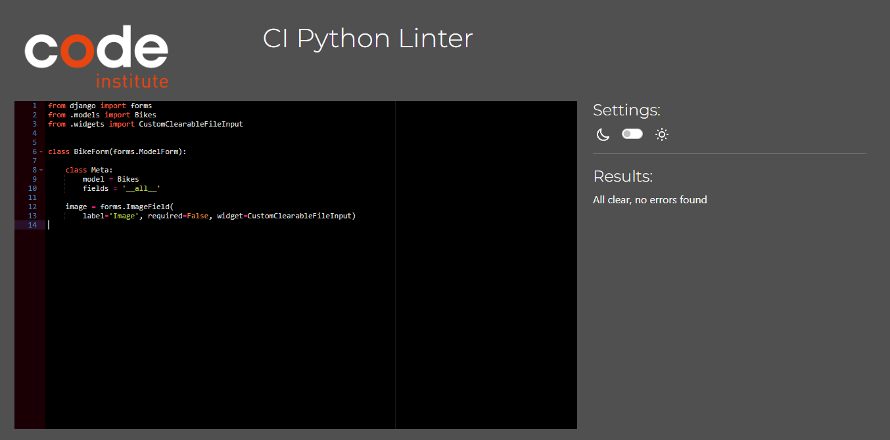
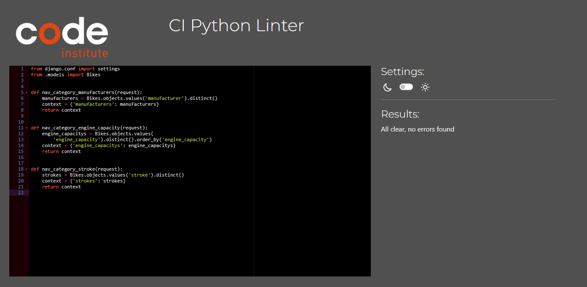
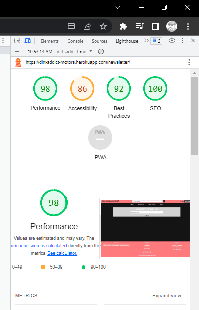

# Dirt Addict Motors

# Goal for this Project
My overall goal for the my project is to creata a website that will sell dirtbike. The user of the website will be able to purachase differernt dirtbikes from various manufacturer and their engine capacity. The User will be able to create a profile so they can make their purachase whicj will be mandartory. The user will be able to adjust the bike in the bag of the website to save time from removing items from the bag and looking for that engine capacity of the bike. The User will be able to save there inforamtion for future purachase so they can save time from filling out their inforamtion agian. The user will be able sign up for a newsltter to keep up to date with the website.

# UX
A user of Dirt Addict Motors can range from a begginner buying there first bike, a novice who may want to upgrade to a faster bike or a seasoned vertern who has much experience in what they are looking for
## User Stories

### Epic | Website Function
* As a SiteUser I can traverse the website so that I can move to other areas of the website easily
* As a SiteUser I can visit the socials of the website so that I can keep up to date with the website
* As a Site User I can sign up for a newsletter so that  I can stay up to date with website
* As a SiteUser I can view the delivery information for order so that I can know how much it will cost for deleivery
* As a SiteUser I can view the FAQS so that I can see the most relevant information

### Epic | Products
* As a SiteUser I can search for a specific bike so that I can quickly see if the bike is available that I am intresting.
* As a SiteUser I can be able to view a selection of bikes at instance so that I can see different types of bikes that are provided in the website
* As a SiteUser I can Sort information of the bikes so that bikes can be filtered by ascending and decending order for cost, year, and A-z
* As a SiteUser I can look at all the bikes that the site has so that I can see the arity of selection of bikes
* As a SiteUser I can View the individual bike object so that I can see me more detailed information on the bike
* As a Site Admin I can add more bikes to the website so that I can keep adding stock to the website
* As a Site Admin I can edit bikes on the website so that I can remove bikes that the store does not sell anymore
* As a SiteAdmin I can delete bikes from the website so that I can keep the website up to date with what is available in the store

### Epic | BAG
* As a SiteUser I can view my bag so that I can see my items in my bag
* As a SiteUser I can change the quantity of each item in the bag so that I don't have to go back to the individual product page to do it
* As a Site User I can change the engine capacity of the bike to another capacity so that I can quickly adjust the bag rather than removing the item to add another item one again
* As a SiteUser I can remove items from the bag so that ** I can adjust my bag to the purchase that I want to checkout with**
### Epic | Checkout
* As a SiteUser I can view my order before checkout so that see I am happy with my purchase
* As a SiteUser I can give my delivery information so that my order can be delivered to the place I want it to
* As a site user I can **enter my payment details ** so that so that I can purchase my order
* As a SiteUser I can be redirected to the checkout success page so that know if my order was successful checkout
* As a SiteUser I can save my information on an order so that I can have default information instead of filling it out every time
### Epic | Profile
* As a SiteUser I can create an account for the site so that I can make purchases from the site
* As a SiteUser I can sign into my personal account so that ** I can view the detail of my account and make edits to the information**
* As a SiteUser I can sign out of my account so that I am not logged in to my account anymore
* As a SiteUser I can I can have a profile page so that display my orders
* As a SiteUser I can save my information so that it can prerender their information when making an order

### Epic | Admin
* As a Admin I can view all the orders on the website so that update the status of the orders if they are complete

## User Requirements and Expectations

### Requirements

* Responsive Design for all screen sizes
* A structured layout to easily view the website 
* CRUD functionality for the products
* User registration
* Checkout Process
* Add to my bag fuction

### Expectations

* I expect to be able to sign in and sign out of my account.
* I expect to be able to add, edit and delete product as an admin.
* I expect to be able to add produsts to my bag.
* I expect to be able to checkout with my purachase.
* I expect to be able to view my orders.
* I expect to be able tro save my inforamtion to the site.

## Wireframes

I have used Balsamic to develop my wireframes for my website. I initially created the mobile version and then the wireframes and then scalled it up for both tablet and desktop. I only created layout's for page that would require alot of content and would change amongst the different screen sizes.

### [Mobile, Tablet and Desktop Wireframe](readmedoc/wireframe/dirtaddictmotor-wireframes.bmpr)

## Design Choices
### Fonts

The font I have chosen are both from [Google Fonts](https://fonts.google.com/)

The first font is [Kanit]((https://fonts.google.com/specimen/Kanit?query=kanit)) which will be the main font that will be seen throughout the website. It will be implemented on all font contnet. Reason from for picking this font is that it is clearly distinguishable from the header font that is very plain and simple as appose to Sono being a very striking font.

The second font is [Poppins]((https://fonts.google.com/specimen/Poppins?query=poppins)) which will be used on all header on the website. Reason for picking the font is mainly due to it plain and simplicity outlook when shown.

### Colours

For choosing my Colors for the website I used [ColorHexa](https://www.colorhexa.com/) and used to [Muzli Colors](https://colors.muz.li/) to create a pallet of the colors.

The colors I choose

.svg "Color Pallet" )
Disregard the last color

| Hex Value | Root variable name | Text | Button | Background | Opposite Colour
| -- | -- | -- | -- | -- | --
| #FF7A7A | red |  |    | x | black,
| #f8f8ff | white | x | x| | black,
| #d3d3d3 | grey |  |  |   x | black ,
| #141414 | black | x | x |  x | grey, white, red,

All of the desired colour combinations have passed the [WebAIM Contrast Checker](https://webaim.org/resources/contrastchecker/ "WebAIM") and the results can be seen below.

| Colour 1 | Colour 2 | Results
| -- | -- | --
| red | black | [result](readmedoc/colors/red-black-test.png)
| red | white | [result](readmedoc/colors/red-black-test.png)
| white | black | [result](readmedoc/colors/white-black-test.png)
| grey | black | [result](readmedoc/colors/black-grey-test.png)

### Images

I have included some images that will render from local files.

* The image on the index page

* the image that will display when the bike has no image

* the image for the honda Manufacturer bikes

* the image for the honda Yamaha bikes

* the image for the honda KTM bikes

* the image for the honda Suzuki bikes

* the fav icon

## Structure

### Modal Diagram

Diagram of all the model of the site

### Models Info

UserProfile Model

| Name | Key | Type | Other Details
| -- | -- | -- | --
| user | | OneToOneField(User, on_delete=models.CASCADE)
|default_phone_number | | CharField(max_length=20, null=True, blank=True)
| default_street_address1 | | CharField(max_length=80, null=True, blank=True)
| default_street_address2 | | CharField(max_length=80, null=True, blank=True)
| default_town_or_city | | CharField(max_length=40, null=True, blank=True)
| default_county | | CharField(max_length=80, null=True, blank=True)
| default_postcode | | CharField(max_length=20, null=True, blank=True)
| default_country | | CountryField(blank_label='Country', null=True, blank=True)

Subscriber Model 

| Name | Key | Type | Other Details
| -- | -- | -- | --
| email | | EmailField(unique=True)
| subscribed_at | | DateTimeField(auto_now_add=True)

Bikes Model

| Name | Key | Type | Other Details
| -- | -- | -- | --
| manufacturer | | models.CharField(max_length=100)
| model | | models.CharField(max_length=100)
| year | | models.IntegerField(validators=[MinValueValidator(1950),MaxValueValidator(2100)], default=2024),
| stroke | | models.IntegerField(choices=STROKE_CHOICES)  STROKE_CHOICES = ((2, '2-stroke'),(4, '4-stroke'),)
| engine_capacity | | models.DecimalField(max_digits=5, decimal_places=2)
| speed | | models.IntegerField()
| weight | | models.DecimalField(max_digits=8, decimal_places=2, default=90)
| seat_height | | models.DecimalField(max_digits=8, decimal_places=2, default=90)
| price | | models.DecimalField(max_digits=8, decimal_places=2)
| starter | | models.CharField(max_length=50, default="Kick")
| description | | models.TextField()
| sku | | models.CharField(max_length=254, null=True, blank=True)
| image | | CloudinaryField(null=True, blank=True)
| created_at | | models.DateTimeField(auto_now_add=True)
| modified_at | | models.DateTimeField(auto_now=True)

Order Model 
| Name | Key | Type | Other Details
| -- | -- | -- | --
| user_profile | ForeignKey | (UserProfile, on_delete=models.SET_NULLnull=True, blank=True related_name='orders')
| order_number | | models.CharField(max_length=32, null=False, editable=False)
| full_name | | models.CharField(max_length=50, null=False, blank=False)
| email | | models.EmailField(max_length=254, null=False, blank=False)
| phone_number | | models.CharField(max_length=20, null=False, blank=False)
| street_address1 | | models.CharField(max_length=80, null=False, blank=False)
| street_address2 | | models.CharField(max_length=80, null=True, blank=True)
| postcode | | models.CharField(max_length=40, null=True, blank=True)
| town_or_city| | models.CharField(max_length=40, null=False, blank=False)
| county | | models.CharField(max_length=80, null=False, blank=False)
| country | | CountryField(blank_label="Country *", null=False, blank=False)
| date | | models.DateTimeField(auto_now_add=True)
| payment_status | | models.CharField(max_length=50, choices=(('PENDING', 'Pending'),('PAID', 'Paid'),('CANCELLED''Cancelled')))
| delivery_cost | | models.DecimalField(max_digits=10, decimal_places=2,null=False, default=0)
| order_total | | models.DecimalField(max_digits=10, decimal_places=2,null=False, default=0)
| grand_total | | models.DecimalField(max_digits=10, decimal_places=2,null=False, default=0)
| original_bag | | models.TextField(null=False, blank=False, default="")
| stripe_pid | | models.CharField(max_length=254, null=False,blank=False, default="")

Order Item
| Name | Key | Type | Other Details
| -- | -- | -- | --
| order | ForeignKey |(Order, on_delete=models.CASCADE,related_name='order_items')
| bike | ForeignKey | (Bikes, on_delete=models.CASCADE)
| quantity | | models.PositiveIntegerField()
| price | | models.DecimalField(max_digits=10, decimal_places=2)

## App Flow

### User

### Admin

# Features

## Existing Features

- **Landing Page**
- This is the landing page that a user will arive on when they first vist the website

## Features to be Implemented

# Tools and Technologies used

# Testing

## Code Validation

### HTML

I have used the [HTML W3C Validator](https://validator.w3.org) to validate all of my HTML files.

As my project uses Jinja syntax, such as ``, ``, and `{{ variable|filter }}`
it will not validate properly if I copy and paste into the HTML validator straight from my source files.

In order to properly validate my HTML pages with Jinja syntax for authenticated pages, I followed these steps:

- Navigate to the deployed pages which require authentication
- Right-click anywhere on the page, and select **View Page Source**.
- This will display the entire "compiled" code, without any Jinja syntax.
- Copy everything, and use the [validate by input](https://validator.w3.org/#validate_by_input) method.
- Repeat this process for every page that requires a user to be logged-in/authenticated.

| Page | Screenshot | Notes |
| --- | --- | --- |
| Home |  | Pass: No Errors
| FAQ |  | Pass: No Errors
| Delivery Info |  | Pass: No Errors
|  Newsletter |  | Pass: No Errors
| Admin-order-history |  | Pass: No Errors
| Product |  | Pass: No Errors
| Product Detail |  | Pass: No Errors
| Add Bike |  | Pass: No Errors
| Edit Bike |  | Pass: No Errors
| Profile |  | Pass: No Errors
| Checkout |  | Pass: No Errors
| Checkout Success |  | Pass: No Errors
| Home |  | Pass: No Errors

### CSS

I have used the recommended [CSS Jigsaw Validator](https://jigsaw.w3.org/css-validator) to validate my CSS file.

| File | Screenshot | Notes |
| --- | --- | --- |
|base.css |  | Pass: No errors
|product.css |  | Pass: No errors
|checkout.css |  | Pass: No errors
|profile.css |  | Pass: No errors

### Javascript

I have used the recommended [JShint Validator](https://jshint.com) to validate all of my JS files.

| File | Screenshot | Notes |
| --- | --- | --- |
| main.js |  | Pass: No Errors
| add-edit script.js |  | Pass: No Errors
| faq-script.js |  | Pass: No Errors
| index-script.js |  | Pass: No Majors Errors
| product-detail-script.js |  | Pass: No Errors
| profile-script.js |  | Pass: No Errors
| stripe-elements.js |  | Pass: No Errors

### Python

I have used the recommended [CI Python Linter](https://pep8ci.herokuapp.com) to validate all of my Python files.

| File | Screenshot | Notes |
| --- | --- | --- | --- |
| settings.py |  | Pass: No Errors
| urls.py (home) |   | Pass: No Errors
| urls.py (bag) |   | Pass: No Errors
| urls.py (checkout) |   | Pass: No Errors
| urls.py (products) |  | Pass: No Errors
| urls.py (profiles) |   | Pass: No Errors
| views.py (profiles) |   | Pass: No Errors
| views.py (home) |   | Pass: No Errors
| views.py (bag) |   | Pass: No Errors
| views.py (checkout) |   | Pass: No Errors
| views.py (products) |   | Pass: No Errors
| models.py (products) |   | Pass: No Errors
| models.py (checkout) |   | Pass: No Errors
| models.py (home) |  | Pass: No Errors
| models.py (profiles) |   | Pass: No Errors
| forms.py (profiles) |   | Pass: No Errors
| forms.py (checkout) |   | Pass: No Errors
| forms.py (home) |   | Pass: No Errors
| forms.py (product) |   | Pass: No Errors
| contexts.py (product) |   | Pass: No Errors
| context.py (bag) |  | Pass: No Errors
| webhook~_handler.py (checkout) |  | Pass: No Errors
| webhooks.py (checkout) |  | Pass: No Errors

## Lighthouse Audit

I've tested my deployed project using the Lighthouse Audit tool to check for any major issues.

| Page | Size | Screenshot | Notes |
| --- | --- | --- | --- |
| Home | Desktop |  | Some major warnings |
| Home | Mobile |  | Some major warnings |
| Addbike | Desktop |  | no major warnings |
| Addbike | Mobile |  | no major warnings |
| Adminorder | Desktop |  | no major warnings |
| Adminorder | Mobile |  | no major warnings |
| Bag | Desktop |  | no major warnings |
| Bag | Mobile |  | no major warnings |
| Checkout | Desktop |  | no major warnings |
| Checkout | Mobile |  | no major warnings |
| Checkout Success | Desktop | | no major warnings |
| Checkout Success | Mobile |  | no major warnings |
| Delivery Info | Desktop |  | no major warnings |
| Delivery Info | Mobile | | no major warnings |
| Edit Bike | Desktop |  | no major warnings |
| Edit Bike | Mobile |  | no major warnings |
| FAQ | Desktop |  | no major warnings |
| FAQ | Mobile |  | no major warnings |
| Newsletter | Desktop |  | no major warnings |
| Newsletter | Mobile |  | no major warnings |
| Product | Desktop |  | no major warnings |
| Product | Mobile |  | no major warnings |
| Product Detail | Desktop |  | no major warnings |
| Product Deatil | Mobile |  | no major warnings |
| Profiles | Desktop |  | no major warnings |
| Profiles | Mobile |  | no major warnings |

## Defensive Programming

Defensive programming was manually tested with the below user acceptance testing:

| Page | User Action | Expected Result | Pass/Fail | Comments |
| --- | --- | --- | --- | --- |
| **Home Page** | | | | |
|| | Click on Logo in the navbar | Redirects to Home page | Pass | |
|| | Click cart Icon in navbar | Redirects to Bag page | Pass | |
|| | Click on Login button when not signed in | Dropdown menu show | Pass |
|| | Click on My account button when signed in | Dropdown menu show | Pass |
|| | Enter Query in to the search bar and click search button | Redirect to product page with search filter showning or message for no search found | Pass |
|| | Click Bikes, Manufacturer, stroke and engine capacity name in the categorey | Dropdown menus show for that category | Pass | 
|| | Click By Price link in the bikes category dropdown | Redirects to the products page, shows bikes order by Highest price, sort by is Price(high to Low) | Pass
|| | Click By Year link in the bikes category dropdown | Redirects to the products page, show the bikes order by most recent year, sort is Year(high to low) | Pass
|| | Click By All bikes link in the bikes category dropdown | Redirects to the products page, shows all bikes in the website, bike order A-z by manufacturer and sort | Pass  
|| | Click on a Manufacturer link in the Manufacturer dropdown | Redirects to the product page, show all the bikes of that manufacturer, ordered by engine capacity | Pass
|| | Click on a Engine Capacity link in the engine capacity dropdown | Redirects to the product page, show all the bikes of that enginecapcity, ordered by A-z manufacturer | Pass
|| | Click on a Stroke link in the stroke dropdown | Redirects to the product page, show all the bikes of that stroke, ordered by engine capacity | Pass
|| | Click on My profile link in the dropdown menu when logged in | Redirects to the user profile page | Pass 
|| | Click on logout button in the dropdown menu when logged in | Redirects to the logout page  | Pass 
|| | Click on My account link in homepage | Redirects to the user profile page | Pass
|| | Click on Start browsing bikes link in homepage | Redirects to the products page, shows all bikes in the website, bike order A-z by manufacturer and sort | Pass
|| | Click on login link in the dropdown menu when not logged in | Redirects to the the sign in page | Pass
|| | Click on register link in the dropdown menu when not logged in | Redirects to the the sign up page | Pass
|| | Click on the bike slide in the carousel | Redirects to the product detail page of that bike | Pass
|| | Click the next button on the carousel | Show the next three bikes in the carousel | Pass
|| | Click the next button on the carousel on the last slide | button is disabled | Pass
|| | Click the previous button when on the first slide | Button is disabled | Pass
|| | Click the previous button when not on the first slide | goes back a slide | Pass
|| | Click on a manufacture logo | Redirects to the product page, show all the bikes of that manufacturer, ordered by engine capacity | Pass
|| | Click on the FAQ in the footer | redirects to the faq page | Pass
|| | Click on the Newsletter in the footer | redirects to the newsletter page | Pass
|| | Click on the Delivery Info in the footer | redirects to the Delivery Info page | Pass
|| | Click on the Admin Orders when signed in as admin in the footer | redirects to the Admin order page | Pass
|| | Click the Search icon on the mobile view of the website| Will show the search bar | Pass
|| | Click the category name on the mobile view | Will open the menu in a  accoriden style | Pass
|| | Click another category name when another is open | the open when will close and the close one will open | P ass
| **Product Page** | | | | |
|| | Click the Bike images of a product | Redirects to the product detail of that bike | Pass
|| | Click the Bike Title of a product | Redirects to the product detail of that bike | Pass
|| | Click the Add to cart button of a product | Adds the bike to the bag, cart icon update by 1 | Pass
|| | Change sort filter to Manufacturer A-Z | Sorts bikes by Manufacturer A-Z | Pass
|| | Change sort filter to Manufacturer Z-A | Sorts bikes by Manufacturer Z-A | Pass
|| | Change sort filter to Price High-Low | Sorts bikes by Price High-Low | Pass
|| | Change sort filter to Price Low-High | Sorts bikes by Price Low-High  | Pass
|| | Change sort filter to Year High-Low | Sorts bikes by Year High-Low | Pass
|| | Change sort filter to Year Low-High | Sorts bikes by Year Low-High | Pass
|| | Change sort filter to Default | Sorts bikes by Manufacturer A-Z | Pass
|| | Click on the next button when showing | goes to next page of bikes | Pass
|| | Click on the previous button when showing | goes to previous page of bikes | Pass
| **Product Detail Page** | | | | |
|| | Click on the add to Cart | Adds the bike to the bag, cart Icon updatas to value of quanity | Pass
|| | Click on the add to Cart with adjusted quanity | Adds to the bag with that quanity, cart icon updates to the value of the adjust quanity | Pass
|| | Click the + sign on the quanity | Add one to the quanity counter | Pass
|| | Click the - sign on the quanity | Decrease one to the quanity counter | Pass
|| | Click the edit bike button as the admin | the admin will be brought to the Edit bike Page | Pass
|| | Click the delete bike button as the admin | the delete confiramtion will be shown | Pass
|| | Click yes on the delete confiramtion bike | the bike will be deleted and the admin will be brough to the products page | Pass
|| | Click no on the delete confiramtion bike | the delete confiramtion will be removed | Pass
| **Bag Page** | | | | |
|| | Click the + sign on the quanity | Add one to the quanity counter | Pass
|| | Click the - sign on the quanity | Decrease one to the quanity counter | Pass
|| | Click the update quanity button when quanity has been changed | Quanity will change to that value | Pass
|| | Click the update quanity button when the value has not changed | Message show informing the no change has been made | Pass
|| | Click the update quanity button when the value is 0 | Bike will be removed from the bag | Pass
|| | Click the update engine capacity when the value has changed | Engine capacity will change to that value | Pass
|| | Click the update engine capacity when the value has not changed | Message show informing the no change has been made | Pass
|| | Click the update engine capacity when the value is changed to a value that already exist in the bag that has the same model | Bike will be removed from bag and the quanity will be added to the other bag | Pass
|| | Change the quanity of a bike then update the bike to another engine capacity that is already in the bag with the same model| Bike will be removed from bag and the quanity will be added to the other bag | Pass
|| | Add a bike to the bag when it already is in the bag | Adds to the bikes quantity | Pass
|| | Click the remove button on a bike in the bag | Will remove the bike from the Bag | Pass
|| | Click the checkout button in the bag | Will bring the user to the checkout page | Pass
|| | Click the checkout button in the bag when not signed in | The user is brought back to the sign in page | Pass
| **Checkout page** | | | | 
|| | When invalid data is place in the Personal Detail form and the user trys to checkout| An error message will be shown on the field in question | Pass
|| | When invalid data is place in the Delivery Detail form and the user trys to checkout| An error message will be shown on the field in question | Pass
|| | When invalid data is place in the Payment form | An error message will be shown above the input the form | Pass
|| | When the User has there inforamtion saved from a previous purachase | Inforamtion will be prerendered | Pass
|| | When the user has inputted correct data in both the payment and delivery inforamtion | The checkout will be proccessed and will be redirect to the checkout success page | Pass
|| | when the user click the adjust bag link | the user should be redirect to the bag | Pass
| **Profiles** | | | | 
|| | Click on a order number of a order | Brings the user to the checkout succes page of that order | Pass
|| | Change data in the Default Delivery Information and click the update inofrmaiton | The inforamtion will be updated | Pass
|| | click the update inforamtion button when no info has changed | message is display saying no update has occured | Pass
|| | Click the bike to store button as admin | Brings the admin to the Add bike page | Pass
| **Admin Orders** | | | | 
|| | Click on a order number of a order | Brings the user to the checkout succes page of that order | Pass
|| | Changes the order status of an order and click the update button | order status changes to the value that was subbmited | Pass
| **Newsletter** | | | | 
|| | click on the sign up button on the newsletter page | user will be redirect to the home page and a messages saying the sign up was successful | Pass
| **FAQ** | | | | |
|| | When the user clicks the question in the container | the answer will open accordin style | Pass
|| | When the user click the quation of a container when another container is opened | THE container will close and the new container will open with the answer | Pass

## User Story Testing

The following are user stories I've implemented with screenshots to prove

### Cloning

You can clone the repository by following these steps:

1. Go to the [GitHub repository](https://github.com/IzzyLeech/dirtaddictmotors)
2. Locate the Code button above the list of files and click it 
3. Select if you prefer to clone using HTTPS, SSH, or GitHub CLI and click the copy button to copy the URL to your clipboard
4. Open Git Bash or Terminal
5. Change the current working directory to the one where you want the cloned directory
6. In your IDE Terminal, type the following command to clone my repository:
	- `git clone https://github.com/IzzyLeech/dirtaddictmotors`
7. Press Enter to create your local clone.

Alternatively, if using Gitpod, you can click below to create your own workspace using this repository.

Please note that in order to directly open the project in Gitpod, you need to have the browser extension installed.
A tutorial on how to do that can be found [here](https://www.gitpod.io/docs/configure/user-settings/browser-extension).

### Forking

By forking the GitHub Repository, we make a copy of the original repository on our GitHub account to view and/or make changes without affecting the original owner's repository.
You can fork this repository by using the following steps:

1. Log in to GitHub and locate the [GitHub Repository](https://github.com/IzzyLeech/dirtaddictmotors)
2. At the top of the Repository (not top of page) just above the "Settings" Button on the menu, locate the "Fork" Button.
3. Once clicked, you should now have a copy of the original repository in your own GitHub account!